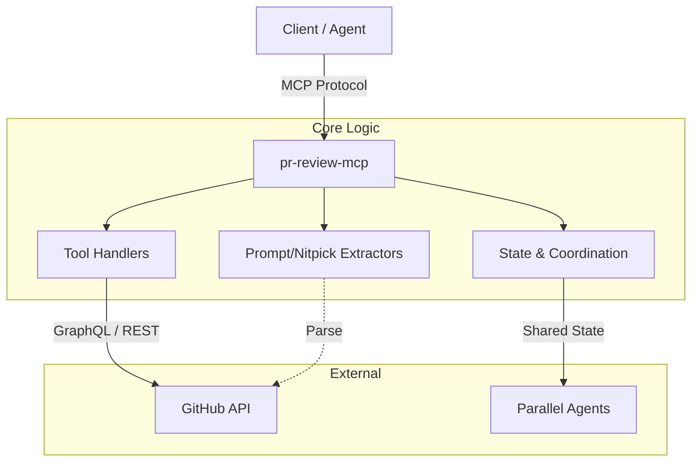

# pr-review-mcp 🤖


**The ultimate Model Context Protocol (MCP) server for orchestrating AI-driven Pull Request reviews.**

`pr-review-mcp` bridges the gap between GitHub's complex GraphQL API and AI agents. It standardizes PR review data from tools like CodeRabbit, Gemini, Copilot, and Sourcery, enabling intelligent agents to read, resolve, and manage code reviews programmatically.

---

## 🚀 Why This Exists

Reviewing code is hard; managing AI reviews is harder. Modern CI/CD pipelines often include multiple AI reviewers (CodeRabbit for summaries, Qodo for testing, Gemini for logic), creating a noisy flood of comments. 

This server solves the **"AI-on-AI" coordination problem**:
1.  **Unified Interface**: One standard API to fetch comments from *any* supported AI agent.
2.  **Noise Reduction**: Automatically splits multi-issue comments and extracts "nitpicks" from bodies.
3.  **Resolution Logic**: Allows agents to resolve outdated threads via GraphQL mutations.
4.  **Parallelism**: Coordinates multiple worker agents to process reviews simultaneously without collision.

---

## ✨ Key Features

- **🔌 GraphQL-Powered Integration**: Efficient cursor-based pagination for large PRs.
- **🤖 Multi-Agent Orchestration**: Native support for CodeRabbit, Gemini, Copilot, Sourcery, Qodo, and Codex.
- **🧠 Prompt Extraction**: Automatically parses the underlying prompt used by AI agents from comment metadata.
- **⚡ Parallel Coordination**: Built-in specialized tools (`claim_work`, `report_progress`) for multi-worker setups, with hybrid Task UI monitoring for real-time progress visibility.
- **🛡️ Resilience**: Implements Circuit Breaker patterns and robust retry logic for GitHub API stability.
- **🧹 Smart Parsing**:
    - **Nitpick Extraction**: Isolates minor issues from CodeRabbit summaries.
    - **Multi-issue Splitting**: Breaks down monolithic comments into actionable items.
    - **Qodo Tracking**: Persistently tracks Qodo comments across commits.

---

## 🏗️ Architecture



---

## 🛠️ Tools

The server exposes **16 optimized tools** for agents.

### 📊 Analysis & Retrieval
| Tool | Description |
|------|-------------|
| `pr_summary` | Get high-level stats (open threads, severity counts). |
| `pr_list` | List comments with advanced filtering (resolved status, file path). |
| `pr_list_prs` | List open pull requests with activity stats. |
| `pr_get` | Get deep details for a specific comment, including the AI prompt. |
| `pr_changes` | Poll for incremental updates since a specific cursor. |
| `pr_poll_updates` | Poll for new comments and agent completion status. |

### ⚡ Action & Management
| Tool | Description |
|------|-------------|
| `pr_resolve` | Mark a review thread as resolved. |
| `pr_invoke` | Trigger a specific AI agent (e.g., CodeRabbit) to re-review. |
| `pr_labels` | Add, remove, or list PR labels. |
| `pr_reviewers` | Request or remove human/team reviewers. |
| `pr_create` | Create a new PR from branches. |
| `pr_merge` | Merge a PR (squash/merge/rebase) with safety checks. |

### 🧩 Orchestration (Multi-Agent)
| Tool | Description |
|------|-------------|
| `pr_claim_work` | Lock a partition of files for a worker agent. |
| `pr_report_progress` | Report status (done/failed) for a claimed task. |
| `pr_get_work_status` | View global orchestration status. |
| `pr_reset_coordination` | Reset coordination state (destructive, requires confirmation). |

---

## 📝 MCP Prompts

The server provides two MCP prompts for guided workflows:

| Prompt | Description |
|--------|-------------|
| `review` (`/pr:review`) | Autonomous multi-agent PR review orchestrator. Spawns parallel workers to process all AI review comments, with real-time Task UI monitoring. |
| `setup` (`/pr:setup`) | Guided onboarding for `.github/pr-review.json` configuration — agent selection, env config, priority. |

---

## 💻 Quick Start

### Prerequisites
- Node.js 18+
- A GitHub Personal Access Token (PAT) with `repo` scope

### Installation

**Option 1: From GitHub (recommended)**
```bash
git clone https://github.com/thebtf/pr-review-mcp.git
cd pr-review-mcp
npm install && npm run build
```

**Option 2: From npm** *(after publish)*
```bash
npm install -g pr-review-mcp
```

### Configuration

Set your GitHub token:
```bash
export GITHUB_PERSONAL_ACCESS_TOKEN=ghp_your_token_here
```

### MCP Client Setup

Add to `claude_desktop_config.json`:

**From local clone:**
```json
{
  "mcpServers": {
    "pr-review": {
      "command": "node",
      "args": ["/path/to/pr-review-mcp/dist/index.js"],
      "env": {
        "GITHUB_PERSONAL_ACCESS_TOKEN": "${GITHUB_PERSONAL_ACCESS_TOKEN}"
      }
    }
  }
}
```

**From npm** *(after publish)*:
```json
{
  "mcpServers": {
    "pr-review": {
      "command": "npx",
      "args": ["-y", "pr-review-mcp"],
      "env": {
        "GITHUB_PERSONAL_ACCESS_TOKEN": "${GITHUB_PERSONAL_ACCESS_TOKEN}"
      }
    }
  }
}
```

---

## 🔍 Examples

### Get PR Summary
```json
{
  "owner": "owner-name",
  "repo": "repo-name",
  "pr": 123
}
```

**Result:**
```json
{
  "total": 45,
  "unresolved": 3,
  "bySeverity": {
    "CRIT": 1,
    "MAJOR": 2,
    "MINOR": 40
  }
}
```

### Invoke AI Reviewer
```json
{
  "owner": "owner-name",
  "repo": "repo-name",
  "pr": 123,
  "agent": "coderabbit"
}
```

### Multi-Agent Orchestration
```json
{
  "agent_id": "worker-1",
  "pr_info": { "owner": "org", "repo": "repo", "pr": 42 }
}
```

---

## 🔗 Related Projects

- **[Serena MCP](https://github.com/oraios/serena)** — Code navigation and symbol-level editing for workers
- **[MCP Specification](https://modelcontextprotocol.io/)** — Model Context Protocol standard

---

## 📜 License

MIT © [thebtf](https://github.com/thebtf)
