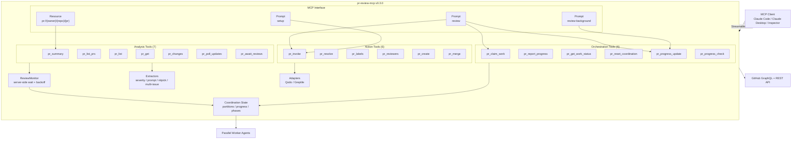

<!-- redoc:start:language-switcher -->
**English** | [Русский](README.ru.md)
<!-- redoc:end:language-switcher -->

<!-- redoc:start:badges -->
[](https://www.npmjs.com/package/pr-review-mcp)
[](https://github.com/thebtf/pr-review-mcp/actions/workflows/ci.yml)
[](LICENSE)
[](https://nodejs.org)
[](https://modelcontextprotocol.io)
<!-- redoc:end:badges -->

<!-- redoc:start:title -->
# pr-review-mcp

Unified MCP control plane for AI pull request reviews on GitHub.
<!-- redoc:end:title -->

<!-- redoc:start:intro -->
Modern pull requests often attract multiple AI reviewers, but their comments arrive in different formats, different places, and different timelines. `pr-review-mcp` turns that noise into one MCP-native workflow: it normalizes review output from seven agent sources, exposes 19 focused tools, and adds orchestration primitives for parallel review handling.

If you use Claude Code, Claude Desktop, or another MCP client to process GitHub reviews, this server gives you one place to list findings, inspect details, invoke agents, wait for them server-side, and coordinate worker agents without building your own review pipeline.
<!-- redoc:end:intro -->

<!-- redoc:start:whats-new -->
## What's New in v0.3.0

- `pr_await_reviews` adds a server-side wait loop for AI reviews, so clients no longer need to poll GitHub manually while agents finish posting.
- `pr_invoke` now returns `since`, `invokedAgentIds`, and `awaitHint`, making the handoff into `pr_await_reviews` explicit and reliable.
- Claude Code integration is stronger with [`skills/review/SKILL.md`](skills/review/SKILL.md), a dedicated skill that wraps `/pr:review` into an autonomous review workflow.
- CI now runs build, tests, and coverage on Node 20 and 22 through GitHub Actions.
- Coverage reporting is part of the release baseline with `@vitest/coverage-v8`; v0.3.0 records 225 Vitest test cases and a 51.7% statement coverage baseline.
- Qodo completion tracking is more accurate because persistent issue comments are detected via `updated_at`, not only `created_at`.
- Agent status polling was simplified by extracting shared logic into `fetchAgentStatusForAgents`, removing duplicated code paths.
- Ten dependency vulnerabilities were resolved as part of the release hardening work.
<!-- redoc:end:whats-new -->

<!-- redoc:start:features -->
## Features

- **Automates multi-agent PR review workflows** with 19 MCP tools, 3 prompts, and 1 dynamic PR resource.
- **Eliminates review-source fragmentation** by normalizing comments from CodeRabbit, Gemini, Copilot, Sourcery, Qodo, Codex, and Greptile.
- **Prevents polling loops in clients** with `pr_await_reviews`, a server-side monitor for agent completion.
- **Coordinates parallel workers safely** with file-level partition claiming, progress reporting, and orchestration status checks.
- **Surfaces machine-readable review data** through structured outputs on key tools such as `pr_summary`, `pr_list`, `pr_get`, `pr_get_work_status`, and `pr_progress_check`.
- **Supports local and shared deployments** through `stdio` by default and StreamableHTTP with `pr-review-mcp --http` or `pr-review-mcp --http 8080`.
- **Protects operational workflows** with confirmation flows for destructive actions such as merge and coordination reset.
- **Ships with Claude Code assets** including `.claude-plugin/plugin.json`, `.mcp.json`, and the review skill for slash-command driven orchestration.
<!-- redoc:end:features -->

<!-- redoc:start:architecture -->
## Architecture


```mermaid
graph TD
    Client["MCP Client<br/>Claude Code / Claude Desktop / Inspector"]

    Client -->|stdio| Server
    Client -->|StreamableHTTP| Server

    subgraph Server["pr-review-mcp v0.3.0"]
        subgraph Interface["MCP Interface"]
            Resource["Resource<br/>pr://{owner}/{repo}/{pr}"]
            PromptReview["Prompt<br/>review"]
            PromptReviewBg["Prompt<br/>review-background"]
            PromptSetup["Prompt<br/>setup"]
        end

        subgraph Analysis["Analysis Tools (7)"]
            T1["pr_summary"]
            T2["pr_list_prs"]
            T3["pr_list"]
            T4["pr_get"]
            T5["pr_changes"]
            T6["pr_poll_updates"]
            T7["pr_await_reviews"]
        end

        subgraph Action["Action Tools (6)"]
            T8["pr_invoke"]
            T9["pr_resolve"]
            T10["pr_labels"]
            T11["pr_reviewers"]
            T12["pr_create"]
            T13["pr_merge"]
        end

        subgraph Orchestration["Orchestration Tools (6)"]
            T14["pr_claim_work"]
            T15["pr_report_progress"]
            T16["pr_get_work_status"]
            T17["pr_reset_coordination"]
            T18["pr_progress_update"]
            T19["pr_progress_check"]
        end

        Monitor["ReviewMonitor<br/>server-side wait + backoff"]
        Extractors["Extractors<br/>severity / prompt / nitpick / multi-issue"]
        Adapters["Adapters<br/>Qodo / Greptile"]
        State["Coordination State<br/>partitions / progress / phases"]
    end

    PromptReview --> T8
    PromptReview --> T14
    PromptReview --> T18
    PromptReviewBg --> T18
    PromptSetup --> T8
    Resource --> T1
    Analysis --> Monitor
    Analysis --> Extractors
    Action --> Adapters
    Orchestration --> State
    Monitor --> State

    Server --> GitHub["GitHub GraphQL + REST API"]
    State --> Workers["Parallel Worker Agents"]
```
<!-- redoc:end:architecture -->

<!-- redoc:start:tools -->
## Tools

### Analysis

| Tool | Description |
|------|-------------|
| `pr_summary` | Return PR review totals, resolution counts, severity breakdowns, file hotspots, and nitpick stats. |
| `pr_list_prs` | List open pull requests in a repository with review activity and change stats. |
| `pr_list` | Enumerate review comments with filters for resolution state, file, source, and severity. |
| `pr_get` | Fetch full detail for a single review thread, including the original body and extracted prompt data. |
| `pr_changes` | Return incremental review updates since a cursor for lightweight refresh workflows. |
| `pr_poll_updates` | Poll for comments, commits, and agent status changes when you need a non-blocking refresh loop. |
| `pr_await_reviews` | Block server-side until selected review agents post updates or a timeout is reached. |

### Action

| Tool | Description |
|------|-------------|
| `pr_invoke` | Trigger one agent or all configured agents for a PR review run. |
| `pr_resolve` | Resolve a GitHub review thread after the issue is handled. |
| `pr_labels` | List, add, remove, or set pull request labels. |
| `pr_reviewers` | Request or remove human and team reviewers on a pull request. |
| `pr_create` | Create a new pull request from existing branches. |
| `pr_merge` | Merge a pull request with confirmation-aware safety checks. |

### Orchestration

| Tool | Description |
|------|-------------|
| `pr_claim_work` | Claim the next pending file partition for a worker agent. |
| `pr_report_progress` | Report completion, failure, or skip status for a claimed partition. |
| `pr_get_work_status` | Inspect the current coordination run, partition counts, and reviewed or pending agents. |
| `pr_reset_coordination` | Clear the active coordination run after explicit confirmation. |
| `pr_progress_update` | Publish orchestrator phase transitions for background workflows. |
| `pr_progress_check` | Read orchestrator phase history and coordination progress in one call. |
<!-- redoc:end:tools -->

<!-- redoc:start:prompts -->
## Prompts

| Prompt | Slash Command | Description |
|--------|---------------|-------------|
| `review` | `/pr:review` | Main autonomous PR review orchestrator for a PR number, URL, or `owner/repo#N`. |
| `review-background` | `/pr:review-background` | Fire-and-forget variant that keeps its own progress tracking without blocking the main chat thread. |
| `setup` | `/pr:setup` | Guided setup prompt for repository-level review configuration and agent defaults. |
<!-- redoc:end:prompts -->

<!-- redoc:start:resources -->
## Resources

`pr://{owner}/{repo}/{pr}` is a dynamic MCP resource that returns pull request metadata and a current review summary in one JSON payload. Use it when a client needs a machine-readable snapshot without issuing multiple tool calls.

Example URI:

```text
pr://thebtf/pr-review-mcp/2
```

Returned data includes PR metadata such as title, state, author, branch names, mergeability, review decision, timestamps, and the same summary dimensions exposed by `pr_summary`.
<!-- redoc:end:resources -->

<!-- redoc:start:quick-start -->
## Quick Start

1. Install the server:

   ```bash
   npm install -g pr-review-mcp
   ```

2. Add it to your MCP client:

   ```json
   {
     "mcpServers": {
       "pr": {
         "command": "pr-review-mcp",
         "env": {
           "GITHUB_PERSONAL_ACCESS_TOKEN": "ghp_your_token_here"
         }
       }
     }
   }
   ```

3. Verify the binary and version:

   ```bash
   pr-review-mcp --version
   ```

Expected output:

```text
pr-review-mcp v0.3.0
```
<!-- redoc:end:quick-start -->

<!-- redoc:start:installation -->
## Installation

### Prerequisites

- Node.js `>=20.0.0`
- A GitHub Personal Access Token with `repo` scope
- An MCP client such as Claude Code, Claude Desktop, or MCP Inspector

### Global npm install

```bash
npm install -g pr-review-mcp
```

### Verify the install

```bash
pr-review-mcp --version
```

### MCP client configuration

Use the globally installed binary in your client config:

```json
{
  "mcpServers": {
    "pr": {
      "command": "pr-review-mcp",
      "env": {
        "GITHUB_PERSONAL_ACCESS_TOKEN": "ghp_your_token_here"
      }
    }
  }
}
```

### Local clone alternative

```bash
git clone https://github.com/thebtf/pr-review-mcp.git
cd pr-review-mcp
npm install
npm run build
```

When running from a clone, point your client at the built entry point:

```json
{
  "mcpServers": {
    "pr": {
      "command": "node",
      "args": ["D:/path/to/pr-review-mcp/dist/index.js"],
      "env": {
        "GITHUB_PERSONAL_ACCESS_TOKEN": "ghp_your_token_here"
      }
    }
  }
}
```

### HTTP mode

Start a StreamableHTTP server on the default port:

```bash
pr-review-mcp --http
```

Or specify a port explicitly:

```bash
pr-review-mcp --http 8080
```
<!-- redoc:end:installation -->

<!-- redoc:start:upgrading -->
## Upgrading

### From v0.2.x to v0.3.0

- Update the package:

  ```bash
  npm install -g pr-review-mcp@0.3.0
  ```

- If your client automation waits for agents, switch from manual polling loops to the new pattern:
  1. Call `pr_invoke`
  2. Read `since` and `invokedAgentIds` from its response
  3. Pass those values into `pr_await_reviews`

- If you copied older README examples, migrate repository config to the nested format actually consumed by `pr_invoke`:

  ```json
  {
    "version": 1,
    "invoke": {
      "agents": ["coderabbit", "gemini", "codex"],
      "defaults": {
        "focus": "best-practices",
        "incremental": true
      }
    }
  }
  ```

- Claude Code users can now rely on [`skills/review/SKILL.md`](skills/review/SKILL.md) for a richer `/pr:review` workflow.
- CI now validates build, tests, and coverage on Node 20 and 22, so local compatibility checks should target the same matrix.
<!-- redoc:end:upgrading -->

<!-- redoc:start:configuration -->
## Configuration

### Environment variables

| Variable | Required | Default | Description |
|----------|----------|---------|-------------|
| `GITHUB_PERSONAL_ACCESS_TOKEN` | Yes | None | GitHub Personal Access Token with `repo` scope. The server exits early if it is missing. |
| `PR_REVIEW_AGENTS` | No | `coderabbit` | Comma-separated agent IDs used when `pr_invoke` resolves `agent: "all"` without repository config. |
| `PR_REVIEW_MODE` | No | `sequential` | Review invocation mode: `sequential` or `parallel`. |

Valid agent IDs are `coderabbit`, `sourcery`, `qodo`, `gemini`, `codex`, `copilot`, and `greptile`.

### Repository config

Create `.github/pr-review.json` in the reviewed repository to define repository-specific defaults:

```json
{
  "version": 1,
  "invoke": {
    "agents": ["coderabbit", "gemini", "codex"],
    "defaults": {
      "focus": "best-practices",
      "incremental": true
    }
  }
}
```

Config resolution order is:

1. `.github/pr-review.json`
2. `PR_REVIEW_AGENTS` and `PR_REVIEW_MODE`
3. Built-in defaults (`coderabbit`, `sequential`)

`invoke.defaults` maps directly to the `options` accepted by `pr_invoke`, so you can preconfigure values such as `focus` and `incremental` at the repository level.
<!-- redoc:end:configuration -->

<!-- redoc:start:usage -->
## Usage

### Workflow 1: Inspect a single PR

Use the analysis tools to summarize and drill into the review state:

```json
{
  "name": "pr_summary",
  "arguments": {
    "owner": "thebtf",
    "repo": "pr-review-mcp",
    "pr": 2
  }
}
```

Then list unresolved findings:

```json
{
  "name": "pr_list",
  "arguments": {
    "owner": "thebtf",
    "repo": "pr-review-mcp",
    "pr": 2,
    "resolved": false
  }
}
```

### Workflow 2: Invoke agents and wait server-side

Trigger one or more AI reviewers:

```json
{
  "name": "pr_invoke",
  "arguments": {
    "owner": "thebtf",
    "repo": "pr-review-mcp",
    "pr": 2,
    "agent": "all"
  }
}
```

Use the returned `since` and `invokedAgentIds` in `pr_await_reviews`:

```json
{
  "name": "pr_await_reviews",
  "arguments": {
    "owner": "thebtf",
    "repo": "pr-review-mcp",
    "pr": 2,
    "since": "2026-03-28T10:00:00.000Z",
    "agents": ["coderabbit", "gemini"],
    "timeoutMs": 600000,
    "pollIntervalMs": 30000
  }
}
```

### Workflow 3: Run an orchestrated parallel review

In Claude Code, start the orchestrator:

```text
/pr:review 2
```

Under the hood, the prompt uses orchestration tools such as `pr_claim_work`, `pr_report_progress`, `pr_progress_update`, and `pr_progress_check` to distribute unresolved comment partitions across worker agents and track progress until review handling is complete.
<!-- redoc:end:usage -->

<!-- redoc:start:claude-code-integration -->
## Claude Code Integration

The repository ships with Claude Code assets:

- [`.claude-plugin/plugin.json`](.claude-plugin/plugin.json) declares the packaged plugin metadata and MCP server bootstrap.
- [`.mcp.json`](.mcp.json) provides an MCP server config that points at the built `dist/index.js`.
- [`skills/review/SKILL.md`](skills/review/SKILL.md) defines the review skill used by `/pr:review`.

Available slash commands:

- `/pr:review`
- `/pr:review-background`
- `/pr:setup`

Minimal Claude Code configuration with the global binary:

```json
{
  "mcpServers": {
    "pr": {
      "command": "pr-review-mcp",
      "env": {
        "GITHUB_PERSONAL_ACCESS_TOKEN": "ghp_your_token_here"
      }
    }
  }
}
```
<!-- redoc:end:claude-code-integration -->

<!-- redoc:start:agent-sources -->
## Agent Sources

| Source | Bot Login Pattern | Comment Type | Notes |
|--------|-------------------|--------------|-------|
| CodeRabbit | `coderabbitai[bot]` | Inline review threads | Supports focus, file filtering, and incremental review options. |
| Gemini | `gemini-code-assist[bot]` | Inline review threads | Invoked through mention-based review commands. |
| Copilot | `copilot-pull-request-reviewer[bot]` | Inline review threads | Parsed as a standard review-thread source. |
| Sourcery | `sourcery-ai[bot]`, `sourcery-ai-experiments[bot]` | Inline review threads | Detection accepts both production and experiments bot patterns. |
| Qodo | `qodo-code-review[bot]` | Issue comment | Persistent review comment updated per commit; readiness uses `updated_at`. |
| Codex | `chatgpt-codex-connector[bot]` | Inline review threads | Mention-based invocation, parsed as a regular review source. |
| Greptile | `greptile-apps[bot]` | Issue overview plus inline review threads | Posts an overview issue comment and may also add inline findings. |

Qodo and Greptile are handled through dedicated adapters because they do not behave like simple inline review-only sources.
<!-- redoc:end:agent-sources -->

<!-- redoc:start:troubleshooting -->
## Troubleshooting

### `GITHUB_PERSONAL_ACCESS_TOKEN` is missing

The server checks prerequisites on startup and exits early if the token is not configured. Add the token to the `env` block of your MCP server entry and restart the client.

### `.github/pr-review.json` seems ignored

`pr_invoke` only reads the nested config under `invoke.agents` and `invoke.defaults`. Invalid JSON falls back to default agents, so validate the file shape before assuming repository config is active.

### HTTP mode does not start

Use the packaged CLI entry point:

```bash
pr-review-mcp --http
```

Or:

```bash
pr-review-mcp --http 8080
```

If you run from a clone instead, build first and invoke `node dist/index.js --http`.

### An agent does not appear to respond

- Confirm the agent is enabled through `.github/pr-review.json` or `PR_REVIEW_AGENTS`.
- Check whether the agent already reviewed the PR; `pr_invoke` skips reviewed agents unless `force` is set.
- Use `pr_await_reviews` for a blocking wait or `pr_poll_updates` if your client needs periodic status refreshes.
- For Qodo, remember that new activity may update one persistent issue comment rather than create fresh review threads.
<!-- redoc:end:troubleshooting -->

<!-- redoc:start:contributing -->
## Contributing

Contributions are welcome. Start with [CONTRIBUTING.md](CONTRIBUTING.md) for setup, validation, and PR submission guidance.
<!-- redoc:end:contributing -->

<!-- redoc:start:license -->
## License

MIT. See [LICENSE](LICENSE).
<!-- redoc:end:license -->
