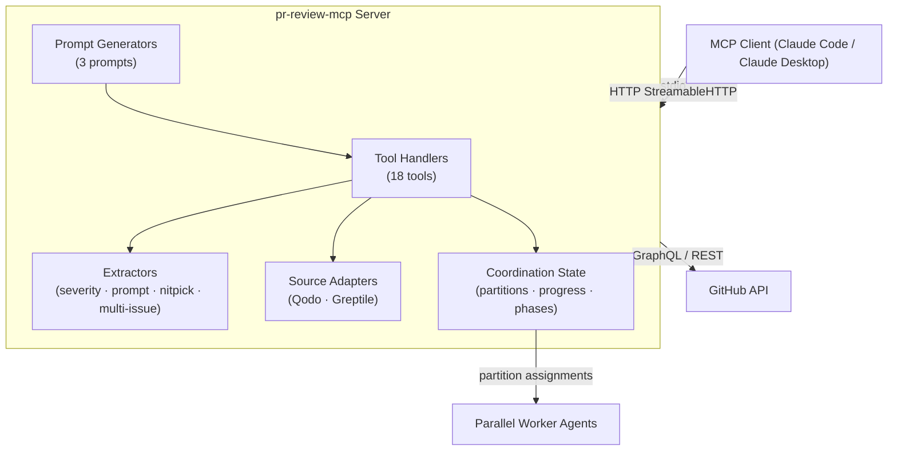

[](https://www.npmjs.com/package/pr-review-mcp)
[](LICENSE)
[](https://nodejs.org)
[](https://modelcontextprotocol.io)

# pr-review-mcp

MCP server for orchestrating AI-driven Pull Request reviews at scale.

## Why This Exists

Modern CI/CD pipelines attach multiple AI reviewers to every PR — CodeRabbit, Gemini, Copilot, Sourcery, Qodo, Greptile — generating a flood of comments that no single agent can process coherently. `pr-review-mcp` solves the coordination problem: it exposes a unified MCP interface over GitHub's GraphQL API, normalizes comments from all supported agents into a consistent schema, and provides first-class primitives for parallel multi-agent review orchestration. A dedicated set of orchestration tools lets worker agents claim file partitions, report progress, and avoid collision without external infrastructure. The result is a single server that turns noisy AI review output into an actionable, structured workflow.

## Key Features

**GitHub Integration**
- GraphQL cursor pagination — zero comments missed on large PRs
- Parallel thread and issue-comment fetching
- ResourceTemplate with URI template parsing (`pr://{owner}/{repo}/{pr}`)
- Single-thread fetch optimization for `pr_get`

**Multi-Source Comment Normalization**
- Unified comment schema across all 7 agent sources
- CodeRabbit nitpick extraction and multi-issue splitting
- Qodo persistent comment tracking across commits
- Greptile HTML and Markdown parsing (overview + inline)

**Structured Output**
- `outputSchema` + `structuredContent` on 5 tools for machine-readable responses
- MCP elicitation for destructive operations (`pr_merge`, `pr_reset_coordination`)

**Orchestration**
- File-level partition claiming with severity-sorted dispatch
- Partition refresh when agents add new comments after a run starts
- Orchestrator phase tracking via `pr_progress_update` / `pr_progress_check`
- Expired run cleanup by inactivity (30-minute threshold)
- Auto-replacement of stale runs (5-minute threshold)

**Transport and Reliability**
- stdio transport (default) and HTTP via StreamableHTTP (`--http [port]`)
- Circuit breaker and rate limiting on GitHub API calls
- Smart agent detection — skip agents that already reviewed (`pr_invoke`)

## Architecture


```mermaid
graph TD
    Client["MCP Client (Claude Code / Claude Desktop)"]

    Client -->|stdio| Server
    Client -->|HTTP StreamableHTTP| Server

    subgraph Server["pr-review-mcp Server"]
        Tools["Tool Handlers\n(18 tools)"]
        Prompts["Prompt Generators\n(3 prompts)"]
        Extractors["Extractors\n(severity · prompt · nitpick · multi-issue)"]
        Adapters["Source Adapters\n(Qodo · Greptile)"]
        Coordination["Coordination State\n(partitions · progress · phases)"]
    end

    Tools --> Extractors
    Tools --> Adapters
    Tools --> Coordination
    Prompts --> Tools

    Server -->|GraphQL / REST| GitHub["GitHub API"]
    Coordination -->|partition assignments| Workers["Parallel Worker Agents"]
```

## Tools

### Analysis

| Tool | Description |
|------|-------------|
| `pr_summary` | High-level statistics: total, resolved, unresolved, outdated counts, breakdown by severity and file. Includes nitpick totals. |
| `pr_list` | List review comments with filtering by resolved status, file path, source agent, and severity. |
| `pr_list_prs` | List open pull requests in a repository with activity stats. |
| `pr_get` | Full detail for a single comment thread, including extracted AI prompt and suggested fix. |
| `pr_changes` | Incremental updates since a cursor — only new or changed threads. |
| `pr_poll_updates` | Poll for new comments and agent completion status; designed for long-running review loops. |

### Action

| Tool | Description |
|------|-------------|
| `pr_resolve` | Resolve a GitHub review thread via GraphQL mutation. |
| `pr_invoke` | Trigger an AI agent to (re-)review the PR. Skips agents that already reviewed unless `force=true`. |
| `pr_labels` | Add, remove, or list labels on a PR. |
| `pr_reviewers` | Request or remove human or team reviewers. |
| `pr_create` | Create a new pull request from branches with title, body, and labels. |
| `pr_merge` | Merge a PR (squash / merge / rebase) with pre-merge safety checks. Uses MCP elicitation to confirm destructive merges. |

### Orchestration

| Tool | Description |
|------|-------------|
| `pr_claim_work` | Claim the next pending file partition for a worker agent. Initializes the run on first call. |
| `pr_report_progress` | Report `done`, `failed`, or `skipped` status for a claimed partition. |
| `pr_get_work_status` | View full run status: partition counts, per-agent progress, pending AI agents, completion flag. |
| `pr_reset_coordination` | Reset all coordination state. Requires explicit `confirm=true` (MCP elicitation). |
| `pr_progress_update` | Update the orchestrator's current phase and detail string for external monitoring. |
| `pr_progress_check` | Read orchestrator phase history and run progress in a single call. |

## Prompts

| Prompt | Slash Command | Description |
|--------|---------------|-------------|
| `review` | `/pr:review` | Autonomous multi-agent PR review orchestrator. Accepts a PR number, URL, or `owner/repo#N` shorthand. Spawns parallel worker agents, each claiming file partitions via `pr_claim_work`. Supports batch mode (all open PRs) when no PR is specified. |
| `review-background` | `/pr:review-background` | Fire-and-forget background review. Manages its own TaskList for progress visibility without blocking the main agent thread. |
| `setup` | `/pr:setup` | Guided onboarding wizard for `.github/pr-review.json` — agent selection, environment variable configuration, and review priority settings. |

## Quick Start

### Prerequisites

- Node.js 18 or later
- A GitHub Personal Access Token with `repo` scope

### Installation

```bash
npm install -g pr-review-mcp
```

To update to the latest version:

```bash
npm install -g pr-review-mcp@latest
```

### MCP Client Setup

Add to `~/.claude/settings.json` (Claude Code) or `claude_desktop_config.json` (Claude Desktop):

```json
{
  "mcpServers": {
    "pr": {
      "command": "pr-review-mcp",
      "env": {
        "GITHUB_PERSONAL_ACCESS_TOKEN": "ghp_your_token_here"
      }
    }
  }
}
```

The token is scoped to this server — no global environment variable needed.

### HTTP Mode

```bash
node dist/index.js --http 8080
```

Starts a StreamableHTTP server on port 8080. Useful for remote agents or shared team deployments.

<details>
<summary>Alternative: run from a local clone</summary>

```bash
git clone https://github.com/thebtf/pr-review-mcp.git
cd pr-review-mcp
npm install && npm run build
```

```json
{
  "mcpServers": {
    "pr": {
      "command": "node",
      "args": ["/path/to/pr-review-mcp/dist/index.js"],
      "env": {
        "GITHUB_PERSONAL_ACCESS_TOKEN": "ghp_your_token_here"
      }
    }
  }
}
```

To update: `git pull && npm install && npm run build`

</details>

## Agent Sources

| Agent | Detection Pattern | Comment Type |
|-------|-------------------|--------------|
| CodeRabbit | `coderabbitai[bot]` | Inline review threads |
| Gemini | `gemini-code-assist[bot]` | Inline review threads |
| Copilot | `copilot-pull-request-reviewer[bot]` | Inline review threads |
| Sourcery | `sourcery-ai[bot]` | Inline review threads |
| Codex | `chatgpt-codex-connector[bot]` | Inline review threads |
| Qodo | `qodo-code-review[bot]` | Issue comment (persistent, updated per commit) |
| Greptile | `greptile-apps[bot]` | Issue comment (overview) + inline review threads |

Qodo uses a persistent review pattern: one issue comment that is updated on each new commit rather than posting new comments. Greptile posts a summary issue comment alongside standard inline review threads.

## Configuration

Create `.github/pr-review.json` in your repository (or use `/pr:setup` to generate it interactively):

```json
{
  "agents": ["coderabbit", "gemini"],
  "mode": "sequential",
  "priority": "severity"
}
```

Environment variables override the config file:

| Variable | Default | Description |
|----------|---------|-------------|
| `GITHUB_PERSONAL_ACCESS_TOKEN` | — | Required. GitHub PAT with `repo` scope. |
| `PR_REVIEW_AGENTS` | `coderabbit` | Comma-separated agent IDs to invoke by default. |
| `PR_REVIEW_MODE` | `sequential` | `sequential` or `parallel` review invocation. |

Valid agent IDs: `coderabbit`, `gemini`, `copilot`, `sourcery`, `qodo`, `codex`, `greptile`.

## Examples

### Get PR summary

Tool call:
```json
{
  "name": "pr_summary",
  "arguments": {
    "owner": "myorg",
    "repo": "myrepo",
    "pr": 42
  }
}
```

Response:
```json
{
  "pr": "myorg/myrepo#42",
  "total": 45,
  "resolved": 38,
  "unresolved": 7,
  "outdated": 2,
  "bySeverity": {
    "CRIT": 1,
    "MAJOR": 4,
    "MINOR": 40
  },
  "byFile": {
    "src/auth/token.ts": 5,
    "src/api/routes.ts": 3
  },
  "nitpicks": {
    "total": 12,
    "resolved": 10
  }
}
```

### Invoke an AI reviewer

```json
{
  "name": "pr_invoke",
  "arguments": {
    "owner": "myorg",
    "repo": "myrepo",
    "pr": 42,
    "agent": "coderabbit"
  }
}
```

Response when agent already reviewed:
```json
{
  "invoked": [],
  "skipped": ["CodeRabbit"],
  "failed": [],
  "message": "Skipped (already reviewed): CodeRabbit. Use force=true to re-invoke."
}
```

### Start an orchestrated review

In Claude Code, run:
```
/pr:review 42
```

The prompt fetches current review state, partitions unresolved comments by file, and spawns parallel worker agents — each calling `pr_claim_work` to lock a partition, processing it, and reporting back via `pr_report_progress`.

## License

MIT © [thebtf](https://github.com/thebtf)
