<!-- redoc:start:language-switcher -->
[English](README.md) | **Русский**
<!-- redoc:end:language-switcher -->

<!-- redoc:start:badges -->
[](https://www.npmjs.com/package/pr-review-mcp)
[](https://github.com/thebtf/pr-review-mcp/actions/workflows/ci.yml)
[](LICENSE)
[](https://nodejs.org)
[](https://modelcontextprotocol.io)
<!-- redoc:end:badges -->

<!-- redoc:start:title -->
# pr-review-mcp

Единая MCP-плоскость управления для AI-ревью Pull Request'ов на GitHub.
<!-- redoc:end:title -->

<!-- redoc:start:intro -->
Современные Pull Request'ы нередко привлекают сразу нескольких AI-ревьюеров, однако их комментарии поступают в разных форматах, из разных мест и в разное время. `pr-review-mcp` превращает этот поток в единый MCP-нативный рабочий процесс: нормализует вывод семи источников агентов, предоставляет 19 специализированных инструментов и добавляет примитивы оркестрации для параллельной обработки ревью.

Если вы используете Claude Code, Claude Desktop или другой MCP-клиент для обработки GitHub-ревью, этот сервер даёт вам одно место, где можно просматривать замечания, инспектировать детали, запускать агентов, ждать их ответа на стороне сервера и координировать рабочие агенты — без необходимости строить собственный review-пайплайн.
<!-- redoc:end:intro -->

<!-- redoc:start:whats-new -->
## Что нового в v0.3.0

- `pr_await_reviews` добавляет серверный цикл ожидания AI-ревью, избавляя клиентов от необходимости вручную опрашивать GitHub, пока агенты публикуют комментарии.
- `pr_invoke` теперь возвращает `since`, `invokedAgentIds` и `awaitHint`, делая передачу управления в `pr_await_reviews` явной и надёжной.
- Интеграция с Claude Code стала глубже благодаря [`skills/review/SKILL.md`](skills/review/SKILL.md) — специализированному скиллу, оборачивающему `/pr:review` в автономный review-воркфлоу.
- CI теперь запускает сборку, тесты и покрытие на Node 18, 20 и 22 через GitHub Actions.
- Отчёты о покрытии включены в базовый контур релиза через `@vitest/coverage-v8`; в v0.3.0 зафиксировано 225 тест-кейсов Vitest и базовое покрытие инструкций 51,7%.
- Отслеживание завершения Qodo стало точнее: персистентные issue-комментарии теперь определяются по `updated_at`, а не только по `created_at`.
- Опрос статуса агентов упрощён путём выделения общей логики в `fetchAgentStatusForAgents` и удаления дублированных путей выполнения.
- В рамках работы по укреплению релиза устранено десять уязвимостей зависимостей.
<!-- redoc:end:whats-new -->

<!-- redoc:start:features -->
## Возможности

- **Автоматизирует мультиагентные рабочие процессы ревью PR** с помощью 19 MCP-инструментов, 3 промптов и 1 динамического PR-ресурса.
- **Устраняет фрагментацию источников ревью**, нормализуя комментарии от CodeRabbit, Gemini, Copilot, Sourcery, Qodo, Codex и Greptile.
- **Исключает polling-циклы в клиентах** с помощью `pr_await_reviews` — серверного монитора завершения работы агентов.
- **Безопасно координирует параллельные рабочие агенты** через захват разделов файлов, отчётность о прогрессе и проверки статуса оркестрации.
- **Предоставляет машиночитаемые данные ревью** через структурированный вывод ключевых инструментов: `pr_summary`, `pr_list`, `pr_get`, `pr_get_work_status` и `pr_progress_check`.
- **Поддерживает локальные и общие деплои** через `stdio` по умолчанию и StreamableHTTP с `pr-review-mcp --http` или `pr-review-mcp --http 8080`.
- **Защищает рабочие процессы** с помощью потоков подтверждения для деструктивных операций — слияния и сброса координации.
- **Поставляется с ассетами Claude Code**, включая `.claude-plugin/plugin.json`, `.mcp.json` и скилл ревью для оркестрации через slash-команды.
<!-- redoc:end:features -->

<!-- redoc:start:architecture -->
## Архитектура

```mermaid
graph TD
    Client["MCP Client<br/>Claude Code / Claude Desktop / Inspector"]

    Client -->|stdio| Server
    Client -->|StreamableHTTP| Server

    subgraph Server["pr-review-mcp v0.3.0"]
        subgraph Interface["MCP Interface"]
            Resource["Resource<br/>pr://{owner}/{repo}/{pr}"]
            PromptReview["Prompt<br/>review"]
            PromptReviewBg["Prompt<br/>review-background"]
            PromptSetup["Prompt<br/>setup"]
        end

        subgraph Analysis["Analysis Tools (7)"]
            T1["pr_summary"]
            T2["pr_list_prs"]
            T3["pr_list"]
            T4["pr_get"]
            T5["pr_changes"]
            T6["pr_poll_updates"]
            T7["pr_await_reviews"]
        end

        subgraph Action["Action Tools (6)"]
            T8["pr_invoke"]
            T9["pr_resolve"]
            T10["pr_labels"]
            T11["pr_reviewers"]
            T12["pr_create"]
            T13["pr_merge"]
        end

        subgraph Orchestration["Orchestration Tools (6)"]
            T14["pr_claim_work"]
            T15["pr_report_progress"]
            T16["pr_get_work_status"]
            T17["pr_reset_coordination"]
            T18["pr_progress_update"]
            T19["pr_progress_check"]
        end

        Monitor["ReviewMonitor<br/>server-side wait + backoff"]
        Extractors["Extractors<br/>severity / prompt / nitpick / multi-issue"]
        Adapters["Adapters<br/>Qodo / Greptile"]
        State["Coordination State<br/>partitions / progress / phases"]
    end

    PromptReview --> T8
    PromptReview --> T14
    PromptReview --> T18
    PromptReviewBg --> T18
    PromptSetup --> T8
    Resource --> T1
    Analysis --> Monitor
    Analysis --> Extractors
    Action --> Adapters
    Orchestration --> State
    Monitor --> State

    Server --> GitHub["GitHub GraphQL + REST API"]
    State --> Workers["Parallel Worker Agents"]
```


<!-- redoc:end:architecture -->

<!-- redoc:start:tools -->
## Инструменты

### Анализ

| Инструмент | Описание |
|------------|----------|
| `pr_summary` | Возвращает общее число ревью-замечаний, счётчики разрешённых, разбивку по серьёзности, горячие файлы и статистику nitpick. |
| `pr_list_prs` | Список открытых Pull Request'ов в репозитории с активностью ревью и статистикой изменений. |
| `pr_list` | Перечисляет ревью-комментарии с фильтрами по статусу разрешения, файлу, источнику и серьёзности. |
| `pr_get` | Получает полные детали одного ревью-треда, включая исходное тело и извлечённые данные промпта. |
| `pr_changes` | Возвращает инкрементальные обновления ревью начиная с курсора для облегчённых refresh-воркфлоу. |
| `pr_poll_updates` | Опрашивает комментарии, коммиты и изменения статуса агентов для неблокирующего цикла обновлений. |
| `pr_await_reviews` | Блокирует выполнение на стороне сервера до тех пор, пока выбранные агенты не опубликуют обновления или не истечёт таймаут. |

### Действия

| Инструмент | Описание |
|------------|----------|
| `pr_invoke` | Запускает одного агента или всех настроенных агентов для прогона ревью PR. |
| `pr_resolve` | Разрешает GitHub ревью-тред после устранения замечания. |
| `pr_labels` | Перечисляет, добавляет, удаляет или устанавливает метки Pull Request'а. |
| `pr_reviewers` | Запрашивает или снимает запрос ревью у людей и команд в Pull Request'е. |
| `pr_create` | Создаёт новый Pull Request из существующих веток. |
| `pr_merge` | Выполняет слияние Pull Request'а с проверками безопасности с подтверждением. |

### Оркестрация

| Инструмент | Описание |
|------------|----------|
| `pr_claim_work` | Захватывает следующий ожидающий файловый раздел для рабочего агента. |
| `pr_report_progress` | Сообщает статус завершения, сбоя или пропуска для захваченного раздела. |
| `pr_get_work_status` | Инспектирует текущий запуск координации, количество разделов, проверенных и ожидающих агентов. |
| `pr_reset_coordination` | Очищает активный запуск координации после явного подтверждения. |
| `pr_progress_update` | Публикует переходы фаз оркестратора для фоновых воркфлоу. |
| `pr_progress_check` | Читает историю фаз оркестратора и прогресс координации в одном вызове. |
<!-- redoc:end:tools -->

<!-- redoc:start:prompts -->
## Промпты

| Промпт | Slash-команда | Описание |
|--------|---------------|----------|
| `review` | `/pr:review` | Основной автономный оркестратор ревью PR по номеру, URL или `owner/repo#N`. |
| `review-background` | `/pr:review-background` | Вариант «запустить и забыть», ведущий собственное отслеживание прогресса без блокировки основного чат-треда. |
| `setup` | `/pr:setup` | Интерактивный промпт для настройки ревью на уровне репозитория и параметров агентов по умолчанию. |
<!-- redoc:end:prompts -->

<!-- redoc:start:resources -->
## Ресурсы

`pr://{owner}/{repo}/{pr}` — динамический MCP-ресурс, возвращающий метаданные Pull Request'а и актуальную сводку ревью в одном JSON-пакете. Используйте его, когда клиенту нужен машиночитаемый снимок без выполнения нескольких вызовов инструментов.

Пример URI:

```text
pr://thebtf/pr-review-mcp/2
```

Возвращаемые данные включают метаданные PR — заголовок, статус, автора, имена веток, возможность слияния, решение по ревью, временные метки — и те же сводные измерения, что предоставляет `pr_summary`.
<!-- redoc:end:resources -->

<!-- redoc:start:quick-start -->
## Быстрый старт

1. Установите сервер:

   ```bash
   npm install -g pr-review-mcp
   ```

2. Добавьте его в конфигурацию MCP-клиента:

   ```json
   {
     "mcpServers": {
       "pr": {
         "command": "pr-review-mcp",
         "env": {
           "GITHUB_PERSONAL_ACCESS_TOKEN": "ghp_your_token_here"
         }
       }
     }
   }
   ```

3. Проверьте бинарник и версию:

   ```bash
   pr-review-mcp --version
   ```

Ожидаемый вывод:

```text
pr-review-mcp v0.3.0
```
<!-- redoc:end:quick-start -->

<!-- redoc:start:installation -->
## Установка

### Требования

- Node.js `>=18.0.0`
- GitHub Personal Access Token с областью `repo`
- MCP-клиент: Claude Code, Claude Desktop или MCP Inspector

### Глобальная установка через npm

```bash
npm install -g pr-review-mcp
```

### Проверка установки

```bash
pr-review-mcp --version
```

### Конфигурация MCP-клиента

Используйте глобально установленный бинарник в конфиге клиента:

```json
{
  "mcpServers": {
    "pr": {
      "command": "pr-review-mcp",
      "env": {
        "GITHUB_PERSONAL_ACCESS_TOKEN": "ghp_your_token_here"
      }
    }
  }
}
```

### Альтернатива: запуск из локального клона

```bash
git clone https://github.com/thebtf/pr-review-mcp.git
cd pr-review-mcp
npm install
npm run build
```

При запуске из клона укажите в клиенте путь к скомпилированной точке входа:

```json
{
  "mcpServers": {
    "pr": {
      "command": "node",
      "args": ["D:/path/to/pr-review-mcp/dist/index.js"],
      "env": {
        "GITHUB_PERSONAL_ACCESS_TOKEN": "ghp_your_token_here"
      }
    }
  }
}
```

### HTTP-режим

Запуск StreamableHTTP-сервера на порту по умолчанию:

```bash
pr-review-mcp --http
```

Или с явным указанием порта:

```bash
pr-review-mcp --http 8080
```
<!-- redoc:end:installation -->

<!-- redoc:start:upgrading -->
## Обновление

### С v0.2.x до v0.3.0

- Обновите пакет:

  ```bash
  npm install -g pr-review-mcp@0.3.0
  ```

- Если ваша клиентская автоматизация ожидает ответа агентов, перейдите от ручных polling-циклов к новому паттерну:
  1. Вызовите `pr_invoke`
  2. Прочитайте `since` и `invokedAgentIds` из ответа
  3. Передайте эти значения в `pr_await_reviews`

- Если вы копировали старые примеры из README, перенесите конфигурацию репозитория во вложенный формат, который действительно использует `pr_invoke`:

  ```json
  {
    "version": 1,
    "invoke": {
      "agents": ["coderabbit", "gemini", "codex"],
      "defaults": {
        "focus": "best-practices",
        "incremental": true
      }
    }
  }
  ```

- Пользователи Claude Code теперь могут опираться на [`skills/review/SKILL.md`](skills/review/SKILL.md) для расширенного воркфлоу `/pr:review`.
- CI теперь проверяет сборку, тесты и покрытие на Node 18, 20 и 22, поэтому локальные проверки совместимости должны ориентироваться на ту же матрицу.
<!-- redoc:end:upgrading -->

<!-- redoc:start:configuration -->
## Конфигурация

### Переменные окружения

| Переменная | Обязательна | По умолчанию | Описание |
|------------|-------------|--------------|----------|
| `GITHUB_PERSONAL_ACCESS_TOKEN` | Да | — | GitHub Personal Access Token с областью `repo`. Сервер завершается при отсутствии. |
| `PR_REVIEW_AGENTS` | Нет | `coderabbit` | Идентификаторы агентов через запятую, используемые когда `pr_invoke` разрешает `agent: "all"` без конфигурации репозитория. |
| `PR_REVIEW_MODE` | Нет | `sequential` | Режим запуска ревью: `sequential` или `parallel`. |

Допустимые идентификаторы агентов: `coderabbit`, `sourcery`, `qodo`, `gemini`, `codex`, `copilot`, `greptile`.

### Конфигурация репозитория

Создайте `.github/pr-review.json` в проверяемом репозитории для определения значений по умолчанию:

```json
{
  "version": 1,
  "invoke": {
    "agents": ["coderabbit", "gemini", "codex"],
    "defaults": {
      "focus": "best-practices",
      "incremental": true
    }
  }
}
```

Порядок разрешения конфигурации:

1. `.github/pr-review.json`
2. `PR_REVIEW_AGENTS` и `PR_REVIEW_MODE`
3. Встроенные значения по умолчанию (`coderabbit`, `sequential`)

`invoke.defaults` напрямую соответствует `options`, принимаемым `pr_invoke`, поэтому можно заранее задать значения `focus` и `incremental` на уровне репозитория.
<!-- redoc:end:configuration -->

<!-- redoc:start:usage -->
## Использование

### Воркфлоу 1: Инспекция одного PR

Используйте инструменты анализа для получения сводки и детального изучения состояния ревью:

```json
{
  "name": "pr_summary",
  "arguments": {
    "owner": "thebtf",
    "repo": "pr-review-mcp",
    "pr": 2
  }
}
```

Затем перечислите неразрешённые замечания:

```json
{
  "name": "pr_list",
  "arguments": {
    "owner": "thebtf",
    "repo": "pr-review-mcp",
    "pr": 2,
    "resolved": false
  }
}
```

### Воркфлоу 2: Запуск агентов и ожидание на стороне сервера

Запустите одного или нескольких AI-ревьюеров:

```json
{
  "name": "pr_invoke",
  "arguments": {
    "owner": "thebtf",
    "repo": "pr-review-mcp",
    "pr": 2,
    "agent": "all"
  }
}
```

Используйте возвращённые `since` и `invokedAgentIds` в `pr_await_reviews`:

```json
{
  "name": "pr_await_reviews",
  "arguments": {
    "owner": "thebtf",
    "repo": "pr-review-mcp",
    "pr": 2,
    "since": "2026-03-28T10:00:00.000Z",
    "agents": ["coderabbit", "gemini"],
    "timeoutMs": 600000,
    "pollIntervalMs": 30000
  }
}
```

### Воркфлоу 3: Оркестрованное параллельное ревью

В Claude Code запустите оркестратор:

```text
/pr:review 2
```

Под капотом промпт использует инструменты оркестрации `pr_claim_work`, `pr_report_progress`, `pr_progress_update` и `pr_progress_check` для распределения неразрешённых разделов комментариев по рабочим агентам и отслеживания прогресса до завершения обработки ревью.
<!-- redoc:end:usage -->

<!-- redoc:start:claude-code-integration -->
## Интеграция с Claude Code

Репозиторий поставляется с ассетами Claude Code:

- [`.claude-plugin/plugin.json`](.claude-plugin/plugin.json) объявляет метаданные упакованного плагина и загрузку MCP-сервера.
- [`.mcp.json`](.mcp.json) предоставляет конфигурацию MCP-сервера, указывающую на скомпилированный `dist/index.js`.
- [`skills/review/SKILL.md`](skills/review/SKILL.md) определяет скилл ревью, используемый `/pr:review`.

Доступные slash-команды:

- `/pr:review`
- `/pr:review-background`
- `/pr:setup`

Минимальная конфигурация Claude Code с глобальным бинарником:

```json
{
  "mcpServers": {
    "pr": {
      "command": "pr-review-mcp",
      "env": {
        "GITHUB_PERSONAL_ACCESS_TOKEN": "ghp_your_token_here"
      }
    }
  }
}
```
<!-- redoc:end:claude-code-integration -->

<!-- redoc:start:agent-sources -->
## Источники агентов

| Источник | Паттерн бота | Тип комментария | Примечания |
|----------|--------------|-----------------|------------|
| CodeRabbit | `coderabbitai[bot]` | Инлайн ревью-треды | Поддерживает focus, фильтрацию файлов и инкрементальное ревью. |
| Gemini | `gemini-code-assist[bot]` | Инлайн ревью-треды | Запускается через mention-based команды ревью. |
| Copilot | `copilot-pull-request-reviewer[bot]` | Инлайн ревью-треды | Разбирается как стандартный источник ревью-тредов. |
| Sourcery | `sourcery-ai[bot]`, `sourcery-ai-experiments[bot]` | Инлайн ревью-треды | Детектирование принимает оба паттерна — production и experiments. |
| Qodo | `qodo-code-review[bot]` | Issue-комментарий | Персистентный комментарий ревью, обновляемый при каждом коммите; готовность определяется по `updated_at`. |
| Codex | `chatgpt-codex-connector[bot]` | Инлайн ревью-треды | Mention-based запуск, разбирается как обычный источник ревью. |
| Greptile | `greptile-apps[bot]` | Issue-обзор плюс инлайн ревью-треды | Публикует обзорный issue-комментарий и может добавлять инлайн-замечания. |

Qodo и Greptile обрабатываются через специализированные адаптеры, поскольку их поведение отличается от простых источников инлайн-ревью.
<!-- redoc:end:agent-sources -->

<!-- redoc:start:troubleshooting -->
## Устранение неполадок

### `GITHUB_PERSONAL_ACCESS_TOKEN` отсутствует

Сервер проверяет предварительные условия при запуске и завершает работу, если токен не настроен. Добавьте токен в блок `env` записи MCP-сервера и перезапустите клиент.

### `.github/pr-review.json` как будто игнорируется

`pr_invoke` читает только вложенную конфигурацию в `invoke.agents` и `invoke.defaults`. Невалидный JSON откатывается к агентам по умолчанию, поэтому проверьте структуру файла перед тем, как считать конфигурацию репозитория активной.

### HTTP-режим не запускается

Используйте упакованную точку входа CLI:

```bash
pr-review-mcp --http
```

Или:

```bash
pr-review-mcp --http 8080
```

При запуске из клона сначала выполните сборку и запустите через `node dist/index.js --http`.

### Агент не отвечает

- Убедитесь, что агент включён через `.github/pr-review.json` или `PR_REVIEW_AGENTS`.
- Проверьте, не проверял ли агент уже этот PR; `pr_invoke` пропускает проверенных агентов, если не установлен флаг `force`.
- Используйте `pr_await_reviews` для блокирующего ожидания или `pr_poll_updates`, если клиенту нужно периодическое обновление статуса.
- Для Qodo помните, что новая активность может обновить один персистентный issue-комментарий, а не создать новые ревью-треды.
<!-- redoc:end:troubleshooting -->

<!-- redoc:start:contributing -->
## Участие в разработке

Мы рады вкладу участников. Начните с [CONTRIBUTING.md](CONTRIBUTING.md) — там описаны настройка среды, правила валидации и процесс отправки PR.
<!-- redoc:end:contributing -->

<!-- redoc:start:license -->
## Лицензия

MIT. См. [LICENSE](LICENSE).
<!-- redoc:end:license -->
