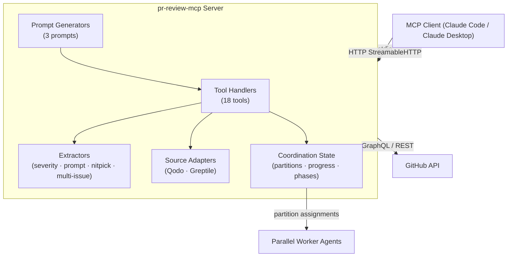

[English](README.md) | **Русский** | [中文](README.zh.md)

[](https://www.npmjs.com/package/pr-review-mcp)
[](LICENSE)
[](https://nodejs.org)
[](https://modelcontextprotocol.io)

# pr-review-mcp

MCP-сервер для оркестрации AI-ревью Pull Request'ов в масштабе.

## Зачем это нужно

Современные CI/CD-пайплайны подключают к каждому PR сразу несколько AI-ревьюеров — CodeRabbit, Gemini, Copilot, Sourcery, Qodo, Greptile — и те генерируют поток комментариев, который ни один агент не в состоянии обработать связно. `pr-review-mcp` решает задачу координации: предоставляет единый MCP-интерфейс поверх GitHub GraphQL API, нормализует комментарии от всех поддерживаемых агентов к единой схеме и даёт готовые примитивы для параллельной мультиагентной оркестрации ревью. Специализированный набор инструментов позволяет рабочим агентам захватывать разделы файлов, отчитываться о прогрессе и не конфликтовать между собой — без какой-либо внешней инфраструктуры. В итоге один сервер превращает шумный AI-вывод в упорядоченный и действенный рабочий процесс.

## Ключевые возможности

**Интеграция с GitHub**
- GraphQL-пагинация с курсором — ни один комментарий не теряется даже на больших PR
- Параллельная загрузка тредов и issue-комментариев
- ResourceTemplate с парсингом URI-шаблонов (`pr://{owner}/{repo}/{pr}`)
- Оптимизированная загрузка одного треда для `pr_get`

**Нормализация комментариев из разных источников**
- Единая схема комментариев для всех 7 источников агентов
- Извлечение nitpick-комментариев CodeRabbit и разбивка multi-issue
- Отслеживание персистентных комментариев Qodo между коммитами
- Парсинг HTML и Markdown от Greptile (обзор + инлайн)

**Структурированный вывод**
- `outputSchema` + `structuredContent` на 5 инструментах для машиночитаемых ответов
- MCP elicitation для деструктивных операций (`pr_merge`, `pr_reset_coordination`)

**Оркестрация**
- Захват разделов на уровне файлов с диспетчеризацией по приоритету серьёзности
- Обновление разделов, когда агенты добавляют новые комментарии в ходе выполнения
- Отслеживание фаз оркестратора через `pr_progress_update` / `pr_progress_check`
- Очистка просроченных запусков по неактивности (порог — 30 минут)
- Автозамена устаревших запусков (порог — 5 минут)

**Транспорт и надёжность**
- Транспорт stdio (по умолчанию) и HTTP через StreamableHTTP (`--http [port]`)
- Circuit breaker и rate limiting на вызовах GitHub API
- Умное определение агентов — пропуск уже проверивших PR агентов (`pr_invoke`)

## Архитектура



## Инструменты

### Анализ

| Инструмент | Описание |
|------------|----------|
| `pr_summary` | Общая статистика: количество комментариев — всего, закрытых, открытых, устаревших; разбивка по серьёзности и файлам; итоговые данные по nitpick. |
| `pr_list` | Список комментариев к ревью с фильтрацией по статусу, пути к файлу, источнику агента и серьёзности. |
| `pr_list_prs` | Список открытых Pull Request'ов в репозитории со статистикой активности. |
| `pr_get` | Полные данные по одному треду комментариев, включая извлечённый AI-промпт и предложенное исправление. |
| `pr_changes` | Инкрементальные обновления с момента курсора — только новые или изменённые треды. |
| `pr_poll_updates` | Опрос новых комментариев и статуса завершения агентов; предназначен для длительных циклов ревью. |

### Действия

| Инструмент | Описание |
|------------|----------|
| `pr_resolve` | Закрыть тред ревью через GraphQL-мутацию. |
| `pr_invoke` | Запустить AI-агент для (повторного) ревью PR. Пропускает агентов, уже выполнивших ревью, если не указан `force=true`. |
| `pr_labels` | Добавить, удалить или просмотреть метки PR. |
| `pr_reviewers` | Запросить ревью от конкретных людей или команд или отменить запрос. |
| `pr_create` | Создать новый Pull Request из веток с заголовком, описанием и метками. |
| `pr_merge` | Слить PR (squash / merge / rebase) с предварительными проверками безопасности. Использует MCP elicitation для подтверждения деструктивного слияния. |

### Оркестрация

| Инструмент | Описание |
|------------|----------|
| `pr_claim_work` | Захватить следующий ожидающий раздел файлов для рабочего агента. При первом вызове инициализирует запуск. |
| `pr_report_progress` | Сообщить статус `done`, `failed` или `skipped` для захваченного раздела. |
| `pr_get_work_status` | Просмотреть полный статус запуска: количество разделов, прогресс по агентам, ожидающие AI-агенты, флаг завершения. |
| `pr_reset_coordination` | Сбросить всё состояние оркестрации. Требует явного `confirm=true` (MCP elicitation). |
| `pr_progress_update` | Обновить текущую фазу и строку детализации оркестратора для внешнего мониторинга. |
| `pr_progress_check` | Прочитать историю фаз оркестратора и прогресс выполнения в одном вызове. |

## Промпты

| Промпт | Команда | Описание |
|--------|---------|----------|
| `review` | `/pr:review` | Автономный мультиагентный оркестратор ревью PR. Принимает номер PR, URL или сокращение `owner/repo#N`. Запускает параллельные рабочие агенты, каждый из которых захватывает разделы файлов через `pr_claim_work`. Поддерживает пакетный режим (все открытые PR), если PR не указан. |
| `review-background` | `/pr:review-background` | Фоновое ревью в режиме «запустить и забыть». Ведёт собственный TaskList для отображения прогресса, не блокируя основной поток агента. |
| `setup` | `/pr:setup` | Интерактивный мастер настройки `.github/pr-review.json` — выбор агентов, настройка переменных окружения и приоритетов ревью. |

## Быстрый старт

### Требования

- Node.js 18 или новее
- GitHub Personal Access Token с правами `repo`

### Установка

```bash
npm install -g pr-review-mcp
```

Для обновления до последней версии:

```bash
npm install -g pr-review-mcp@latest
```

### Настройка MCP-клиента

Добавьте в `~/.claude/settings.json` (Claude Code) или `claude_desktop_config.json` (Claude Desktop):

```json
{
  "mcpServers": {
    "pr": {
      "command": "pr-review-mcp",
      "env": {
        "GITHUB_PERSONAL_ACCESS_TOKEN": "ghp_your_token_here"
      }
    }
  }
}
```

Токен привязан к этому серверу — глобальная переменная окружения не нужна.

### HTTP-режим

```bash
node dist/index.js --http 8080
```

Запускает StreamableHTTP-сервер на порту 8080. Удобно для удалённых агентов или командных деплоев.

<details>
<summary>Альтернатива: запуск из локального клона</summary>

```bash
git clone https://github.com/thebtf/pr-review-mcp.git
cd pr-review-mcp
npm install && npm run build
```

```json
{
  "mcpServers": {
    "pr": {
      "command": "node",
      "args": ["/path/to/pr-review-mcp/dist/index.js"],
      "env": {
        "GITHUB_PERSONAL_ACCESS_TOKEN": "ghp_your_token_here"
      }
    }
  }
}
```

Для обновления: `git pull && npm install && npm run build`

</details>

## Источники агентов

| Агент | Паттерн определения | Тип комментария |
|-------|---------------------|-----------------|
| CodeRabbit | `coderabbitai[bot]` | Инлайн-треды ревью |
| Gemini | `gemini-code-assist[bot]` | Инлайн-треды ревью |
| Copilot | `copilot-pull-request-reviewer[bot]` | Инлайн-треды ревью |
| Sourcery | `sourcery-ai[bot]` | Инлайн-треды ревью |
| Codex | `chatgpt-codex-connector[bot]` | Инлайн-треды ревью |
| Qodo | `qodo-code-review[bot]` | Issue-комментарий (персистентный, обновляется при каждом коммите) |
| Greptile | `greptile-apps[bot]` | Issue-комментарий (обзор) + инлайн-треды ревью |

Qodo использует паттерн персистентного ревью: один issue-комментарий, который обновляется при каждом новом коммите вместо публикации новых. Greptile публикует сводный issue-комментарий вместе со стандартными инлайн-тредами ревью.

## Конфигурация

Создайте `.github/pr-review.json` в своём репозитории (или используйте `/pr:setup` для интерактивной генерации):

```json
{
  "agents": ["coderabbit", "gemini"],
  "mode": "sequential",
  "priority": "severity"
}
```

Переменные окружения переопределяют файл конфигурации:

| Переменная | По умолчанию | Описание |
|------------|--------------|----------|
| `GITHUB_PERSONAL_ACCESS_TOKEN` | — | Обязательно. GitHub PAT с правами `repo`. |
| `PR_REVIEW_AGENTS` | `coderabbit` | ID агентов через запятую для вызова по умолчанию. |
| `PR_REVIEW_MODE` | `sequential` | `sequential` или `parallel` — режим запуска ревью. |

Допустимые ID агентов: `coderabbit`, `gemini`, `copilot`, `sourcery`, `qodo`, `codex`, `greptile`.

## Примеры

### Получить сводку PR

Вызов инструмента:
```json
{
  "name": "pr_summary",
  "arguments": {
    "owner": "myorg",
    "repo": "myrepo",
    "pr": 42
  }
}
```

Ответ:
```json
{
  "pr": "myorg/myrepo#42",
  "total": 45,
  "resolved": 38,
  "unresolved": 7,
  "outdated": 2,
  "bySeverity": {
    "CRIT": 1,
    "MAJOR": 4,
    "MINOR": 40
  },
  "byFile": {
    "src/auth/token.ts": 5,
    "src/api/routes.ts": 3
  },
  "nitpicks": {
    "total": 12,
    "resolved": 10
  }
}
```

### Запустить AI-ревьюер

```json
{
  "name": "pr_invoke",
  "arguments": {
    "owner": "myorg",
    "repo": "myrepo",
    "pr": 42,
    "agent": "coderabbit"
  }
}
```

Ответ, когда агент уже выполнил ревью:
```json
{
  "invoked": [],
  "skipped": ["CodeRabbit"],
  "failed": [],
  "message": "Skipped (already reviewed): CodeRabbit. Use force=true to re-invoke."
}
```

### Запустить оркестрованное ревью

В Claude Code выполните:
```
/pr:review 42
```

Промпт получает текущее состояние ревью, разбивает нерешённые комментарии на разделы по файлам и запускает параллельные рабочие агенты — каждый вызывает `pr_claim_work` для захвата раздела, обрабатывает его и отчитывается через `pr_report_progress`.

## Лицензия

MIT © [thebtf](https://github.com/thebtf)
